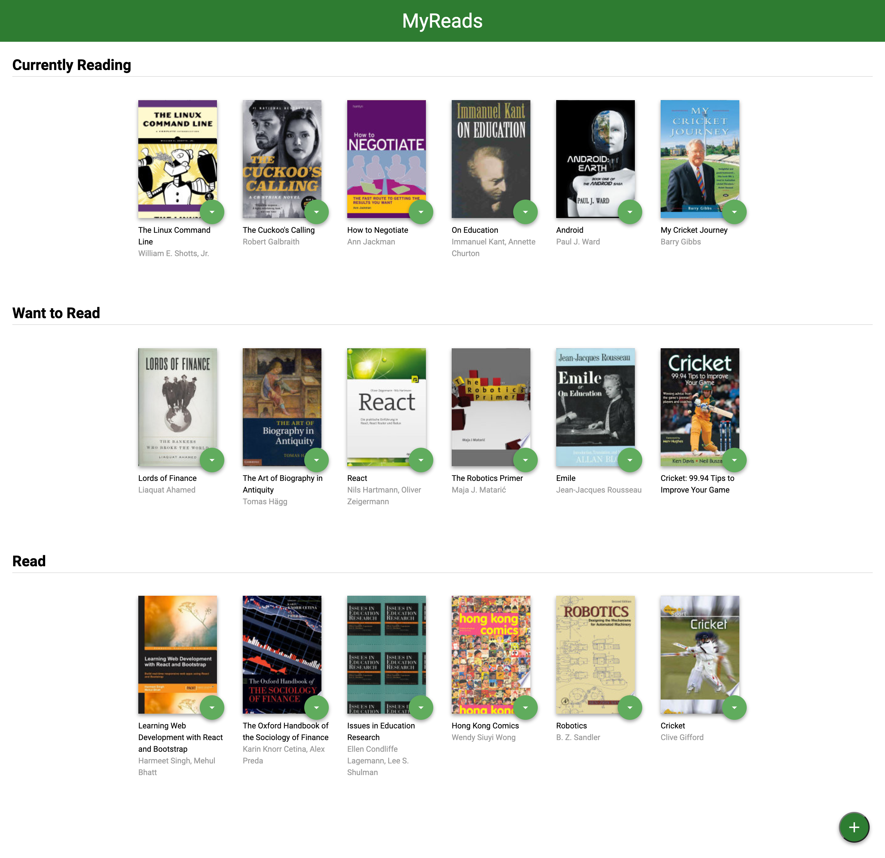
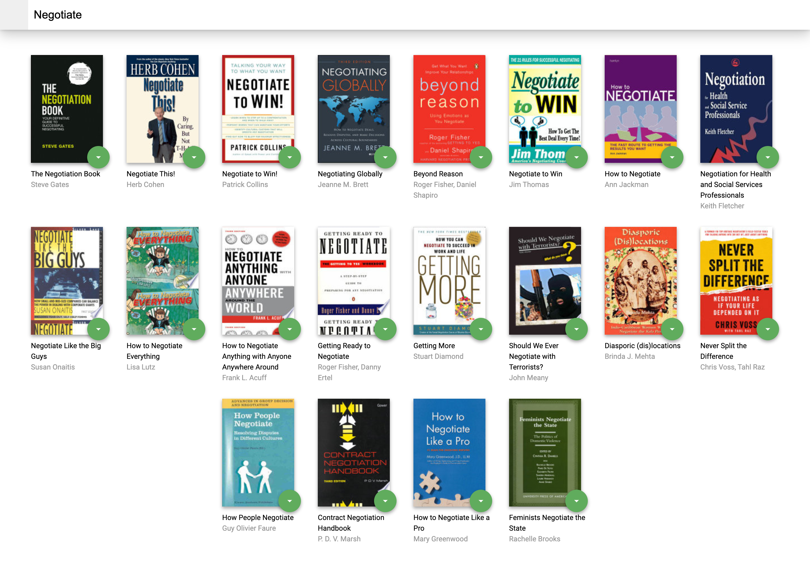

# MyReads Project

This is the starter template for the final assessment project for Udacity's React Fundamentals course. The goal of this template is to save you time by providing a static example of the CSS and HTML markup that may be used, but without any of the React code that is needed to complete the project. If you choose to start with this template, your job will be to add interactivity to the app by refactoring the static code in this template.

## Instructions to run app

To get started using this app right away:

* Install all project dependencies with `npm install`
* Start the server with `npm start`
* Visit http://localhost:3000/

## Sample Screenshots

